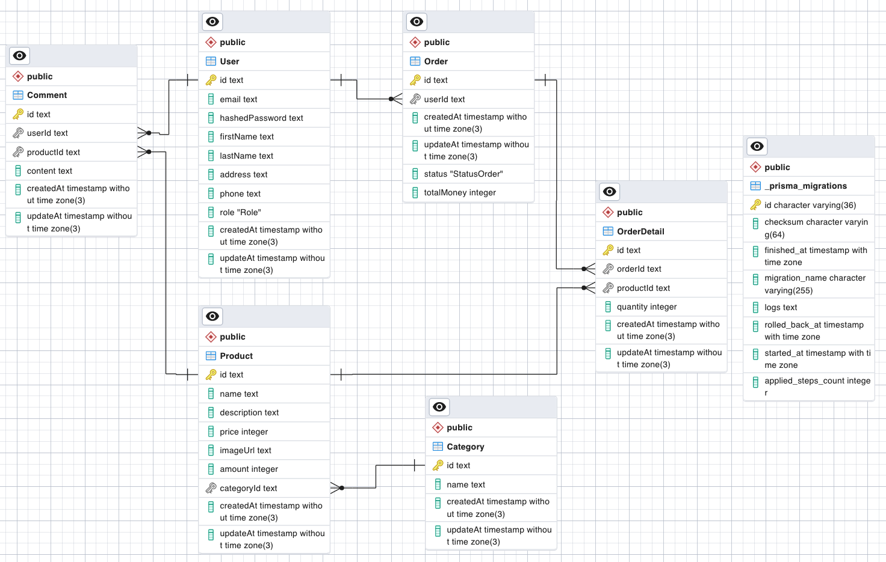

**Отношения** сущностей:

- Один пользователь может создавать несколько заказов (One-to-Many)
- Один заказ принадлежит только одному пользователю (One-to-Many)
- В одном заказе может быть много позиций (один ко многим).
- Один продукт может быть размещен в нескольких позициях (One-to-Many).
- Один пользователь может создавать несколько комментариев (один ко многим).
- Один товар может иметь несколько комментариев (One-to-Many)

